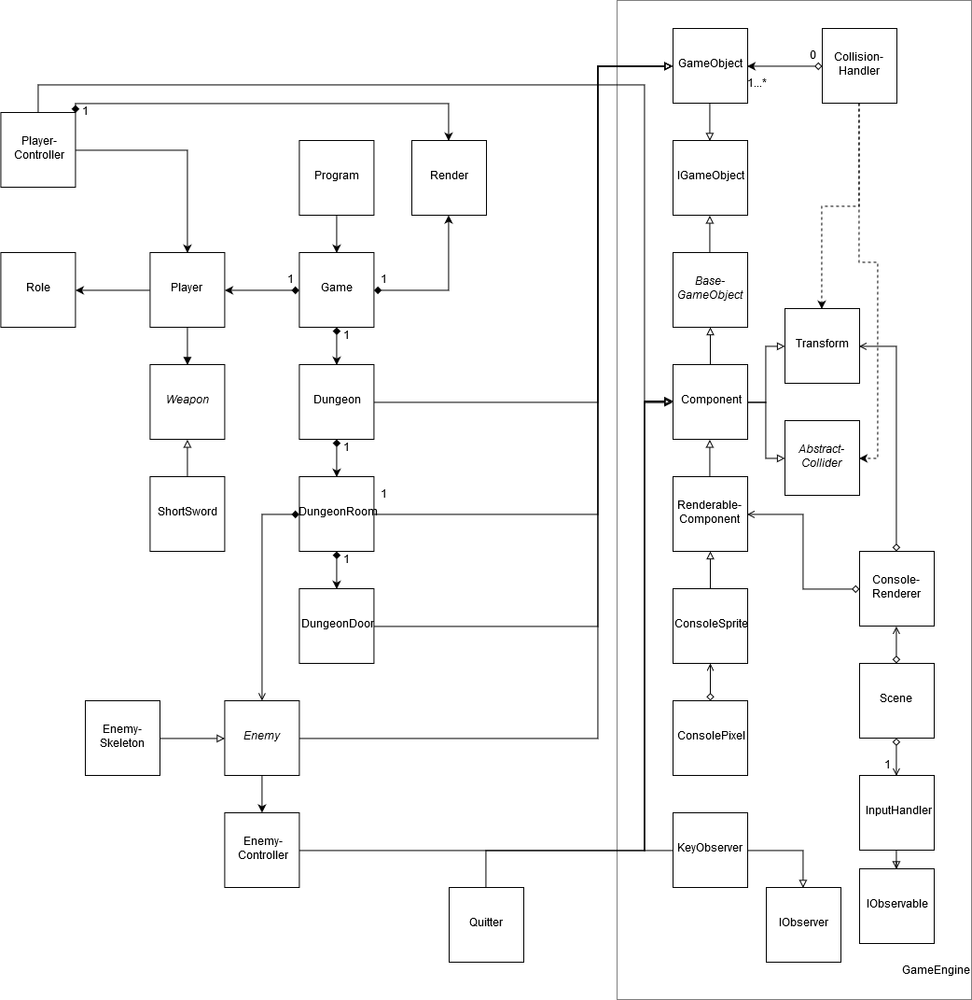

# 2º Projeto de Linguagens de Programação II 2019/2020

## Autores

*[João Rebelo - a21805230](https://github.com/JBernardoRebelo)*

*[Miguel Fernández - a21803644](https://github.com/MizuRyujin)*

### Repositório Git

[2º Projeto LPII, Fernandez
 e Rebelo](https://github.com/JBernardoRebelo/Projeto2_LPII_Fernandez_Rebelo)

### Quem fez o quê

## Descrição e arquitetura da Solução

### Design Patterns utilizados

Gameloop;

Component;

Composite;

## Diagrama UML

## Referências

#### *[.NET API](https://docs.microsoft.com/en-us/dotnet/api/?view=netcore-2.2)*

- *[Vector2 Struct](https://docs.microsoft.com/en-us/dotnet/api/system.numerics.vector2?view=netframework-4.8)*
- *[Finalizers ](https://docs.microsoft.com/en-us/dotnet/csharp/programming-guide/classes-and-structs/destructors)*
- *[GC.Collect Method](https://docs.microsoft.com/en-us/dotnet/api/system.gc.collect?view=netframework-4.8)*

#### *[Stack overflow](https://stackoverflow.com/)*

- *[Remove Item in Dictionary based on Value](https://stackoverflow.com/questions/1636885/remove-item-in-dictionary-based-on-value)*
- *[Detect collision between a moving object and an immobile one](https://stackoverflow.com/questions/3195495/detect-collision-between-a-moving-object-and-an-immobile-one)*
- *[Destroy an object in C#](https://stackoverflow.com/questions/25764965/destroy-an-object-in-c-sharp/25765055)*

## **Instruções:**

- Escrever "credits" ou 'c' para os creditos;
- Escrever "exit" ou 'e' para sair; 
- Pressionar qualquer tecla no menu inicial para começar:
  - Escrever o nome da classe desejada;
  - De seguida o nome do jogador;
- No jogo:
  - Atacar inimigos para ganhar XP e subir de nível;
  - Eliminar todos os inimigos causa vitória e morrer causa derrota;

## Controlos

- 'WASD' para mover o personagem;
- 'Space' para atacar;
- 'C' para mostrar detalhes do personagem;
- 'E' para abrir portas e entrar na respetiva sala;
- (Por agora) Escrever a opção pretendida dentro de menus;

## **Notas de dev:**

### **De Essencial implementação:**

- Implementação o Game Loop e o Update Method. **X**
- Duas threads: a thread principal do jogo (que executa o game loop) e uma thread para ler input do utilizador. **X**
- Implementar as mecânicas base do jogo original:
  - Movimento ´WASD´; **X**
  - 1 Ataque skill; **X**
  - 1 Inimigo atacável; **X**
  - 1 coletável a definir;
  - 1 dungeon explorável; **X**
- Ser jogável e ter algum tipo de pontuação:
  - XP que se ganha ao matar inimigo; **X**
  - Ter algum tipo de ecrã inicial ou opção no menu onde sejam explicadas 
  as regras e indicados os controlos do jogo;
  - Menu de escolha de classes com 2 classes,  warrior e rogue; **X**
  - Regras e controlos;

### **Mecânicas omitidas de desenvolvimento que poderiam ser implementados**

- Sistema de inventário e Lojas/Transações de Gold
  - De momento só existe 1 item possível e é a _Short Sword_ usada para atacar;
  - Ver detalhes de personagem mostra também a arma e os seus detalhes
- Classe _Sorcerer_;
- Várias _stats_ de classe;
- Interações e existência de NPC's;
- Controlo e ataque de jogador com rato (utilizar o teclado pareceu mais prático de implementar);
